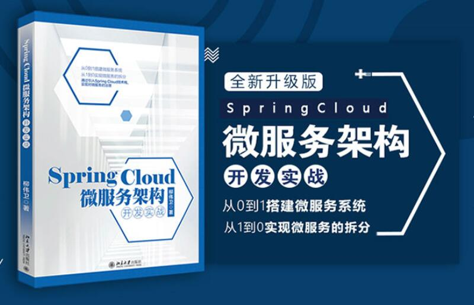

# spring-cloud
spring-cloud微服务架构
## 说明
     Spring Cloud微服务架构开发实战源码
     
 

* 利用开源部署的前后端项目 http://49.235.46.98:8080
* Gradle与Maven的对比：Maven支持多模块构建，Gradle支持多项目构建。依赖管理Gradle的编写较简短，在性能比对中，在Gradle团队做的性能测试用报告中，Gradle比Maven快10倍以上。
* Restful服务，适用于为客户创建在互联网传播的轻量级的Web服务API
* 安全机制认证：OAuth2认证，规范标准参考，http://tools.ietf.org/html/rfc6749
* Spring-Security教程：https://github.com/waylau/spring-security-tutorial
* 跨域访问：CORS允许Web服务器进行跨域访控制，https://www.w3.org/TR/cors/
* 更高级别的消息中间件，RabbitMA
* 数据持久化， Spring Data JPA，https://github.com/waylau/essential-javaee
* Spring Cloud Config，配置中心，利用git来集中管理程序的配置，https://cloud.spring.io/spring-cloud-config/reference/html/
* Spring Cloud Netflix，集成众多的开源软件，包括Eureka、Hystrix、Zuul、Archaius等，https://cloud.spring.io/spring-cloud-netflix/reference/html/
* Spring Cloud Bus，消息总线，https://cloud.spring.io/spring-cloud-bus
* Spring Cloud Cluster，基于Zookeeper、Redis、Hazelcast、Consul实现的领导选举与平民状态模式的抽象和实现，https://cloud.spring.io/spring-cloud
* Eureka是Netfix开源的一款提供服务注册和发现的产品，https://cloud.spring.io/spring-cloud-netfix
* Netfix Ribbon是基于http和tcp的客户端负载均衡器
* Feign是一个声明式的Web服务器
* API网关实现的开源产品，nginx、tyk、kong、zuul等
* DevOps用于开发、技术运营和质保部门之间的沟通、协作与整合
* Docker，用于构建、运行、发布的容器
* Hystrix，熔断机制